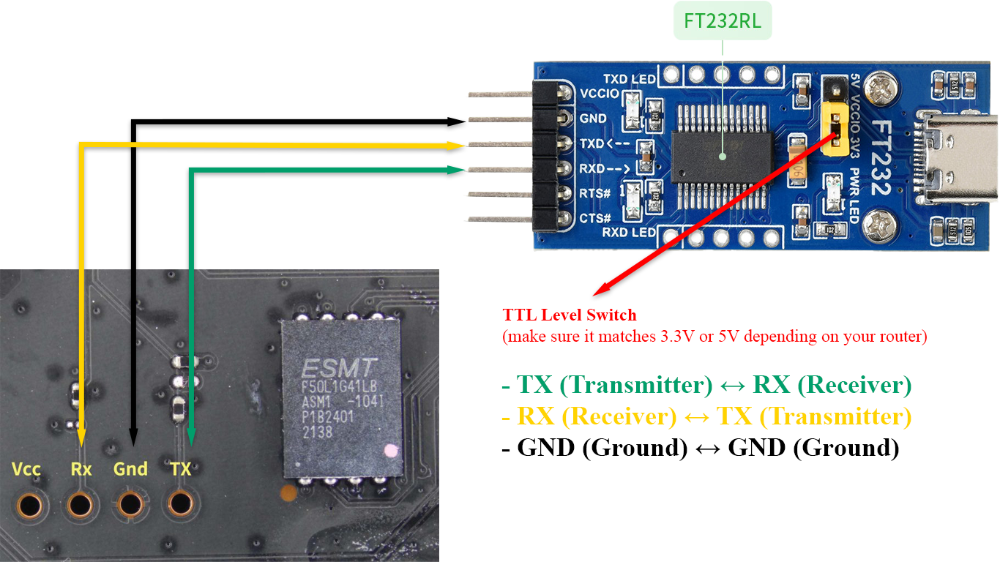

Trang này để tổng hợp thông tin, công cụ cho việc nghiên cứu wifi / router - chủ yếu là về OpenWRT và các biến thể liên quan.

## 1. Công cụ phần cứng & Gỡ lỗi (Hardware Tools)

### 1.1. [Opening pick / Pry tool / Spudger](https://en.wikipedia.org/wiki/Spudger)

Bộ dụng cụ dùng để nạy vỏ router không bị toác ngàm, trầy xước hay gãy chốt nhựa.

### 1.2. Hàn thiếc

Video hướng dẫn (tìm thấy trên mạng): [HÀN THIẾC - HÀN CHÌ QUÁ ĐƠN GIẢN | HƯỚNG DẪN CHI TIẾT | KINH NGHIỆM BẢN THÂN DÀNH TẶNG ANH EM](https://youtu.be/mZpYkeVuVdE?si=7DA_IadlZeiBlPyd).

#### 1.2.1. [Desoldering - Hút thiếc](https://en.wikipedia.org/wiki/Desoldering)

- **Mục đích:** Dụng cụ cơ khí dạng ống bơm chân không (hoặc loại kết hợp nhiệt) dùng để hút sạch chì hàn nóng chảy ra khỏi các mối hàn trên bo mạch router.
- **Ứng dụng:**
    - **Hút chân linh kiện:** Cực kỳ cần thiết khi cần tháo rời các linh kiện xuyên lỗ (thru-hole components) trên mainboard router như giắc cắm nguồn, cổng mạng RJ45, tụ điện, hoặc đặc biệt là việc nhấc chip Flash / EEPROM ra ngoài để nạp lại trực tiếp bằng mạch nạp khi router bị brick nặng mà cổng UART không còn cứu được.
    - **Sửa chữa phần cứng (Hardware Mod):** Dùng khi muốn thay thế linh kiện nâng cấp (như độ chip Flash dung lượng lớn hơn, thay RAM, hoặc hàn thêm các chân pin header UART/JTAG mà nhà sản xuất đã lược bỏ trên bo mạch).
- **Lưu ý:** Nên kết hợp sử dụng cùng mỏ hàn có điều chỉnh nhiệt độ chuẩn để tránh làm bong tróc các vi mạch, đứt mạch in (PCB traces) trên bo mạch vốn rất mỏng của router. Mua thêm đầu silicone chịu nhiệt sẽ dễ hút hơn.

#### 1.2.2. [Soldering iron - Mỏ hàn](https://en.wikipedia.org/wiki/Soldering_iron)

Dùng để hàn chân pin header và các linh kiện khác; nên mua loại có điều chỉnh nhiệt độ chính xác.

#### 1.2.3. [Solder - Thiếc hàn](https://en.wikipedia.org/wiki/Solder)

Hợp kim hàn thường là dạng cuộn dây dùng để liên kết kim loại trên bo mạch.

#### 1.2.4. [Flux - Nhựa thông / Mỡ hàn](https://en.wikipedia.org/wiki/Flux_(metallurgy))

Chất trợ hàn giúp làm sạch bề mặt kim loại, tăng độ bám dính của chì hàn, giúp mối hàn sáng bóng và hạn chế chập mạch khi hàn các chân linh kiện nhỏ.

### 1.3. UART Console

Sơ đồ kết nối UART (Pinout Connection)

- **TX (Transmitter) $\rightarrow$ RX (Receiver)**
- **RX (Receiver) $\rightarrow$ TX (Transmitter)**
- **GND (Ground) $\rightarrow$ GND (Ground)**

> **Lưu ý quan trọng:** Chân truyền dữ liệu (TX) của thiết bị này phải nối vào chân nhận dữ liệu (RX) của thiết bị kia và ngược lại. **Tuyệt đối không nối chân VCC/5V** từ cáp USB-to-serial vào bo mạch router để tránh xung đột điện áp làm cháy phần cứng.

#### 1.3.1. [USB-to-serial adapter - Cáp chuyển đổi USB sang UART / TTL](https://en.wikipedia.org/wiki/USB-to-serial_adapter)

- **Mục đích:** Công cụ sống còn khi nghiên cứu router. Dùng để kết nối trực tiếp chân UART trên bo mạch router với máy tính qua giao diện dòng lệnh nối tiếp (Serial Console).
- **Ứng dụng:**
    - Đọc boot log toàn bộ quá trình khởi động của router để phát hiện lỗi kernel panic hoặc xung đột phần cứng.
    - Truy cập vào bộ nạp khởi động (U-Boot / Breed / RedBoot) để can thiệp sâu trước khi hệ điều hành chính được load.
    - **Cứu hộ (Unbrick):** Cứu router khi bị treo boot, hỏng phân vùng U-Boot/firmware, cho phép nạp lại file firmware gốc qua giao thức TFTP trực tiếp từ tầng bootloader.
- **Lưu ý:** Luôn kiểm tra mức điện áp logic của board mạch router (phổ biến nhất là 3.3V). Tuyệt đối không cắm nhầm nguồn 5V để tránh làm cháy chip giao tiếp serial trên router.

#### 1.3.2. [Pin header](https://en.wikipedia.org/wiki/Pin_header)

Mua hàng rào đực đơn hàn vào lỗ cắm UART để nối với dây cắm (jumper wire).

#### 1.3.3. [Jump wire - Dây cắm test (Dupont wire)](https://en.wikipedia.org/wiki/Jump_wire)

Mua loại đầu cắm cái - cái (female - female) để nối từ cáp chuyển đổi USB-to-serial sang các chân pin header đã hàn trên bo mạch.

### 1.4. [Multimeter - Đồng hồ vạn năng](https://en.wikipedia.org/wiki/Multimeter)

Dùng để đo điện (kiểm tra mức 3.3V/5V), kiểm tra thông mạch (chân GND, TX, RX) và dò đường mạch trên bo mạch router một cách an toàn.

Video hướng dẫn (lụm trên mạng): [Hướng dẫn sử dụng Đồng hồ đo điện vạn năng ANENG DT9205A](https://youtu.be/CB15Mgnu2tM?si=hT4oBQDjgiVboS5F).

> *Lưu ý: Phần hình ảnh thực tế và danh mục chi tiết các trang thiết bị đang sử dụng cập nhật để anh em tham khảo (repo mang tính chất chia sẻ kỹ thuật, không có link mua bán thương mại).*

## 2. Phần mềm & Công cụ lập trình (Software & Code)

Các dự án liên quan
- [ImmortalWrt build cho 32X6 và NR3053](https://github.com/quytttb/immortalwrt-mt798x-rebase)

Các trang web hữu ích
- [Bộ định tuyến giao lưu (Tiếng Trung)](https://www.acwifi.net)
- [Diễn đàn Không dây Ân Sơn (Tiếng Trung)](https://www.right.com.cn)
- [Hardware Hacking Wiki](https://www.hardbreak.wiki)
- [How ARM Systems are Booted: An Introduction to the ARM Boot Flow - Rouven Czerwinski](https://youtu.be/GXFw8SV-51g?si=jdVqblgRJGEHMvyH)